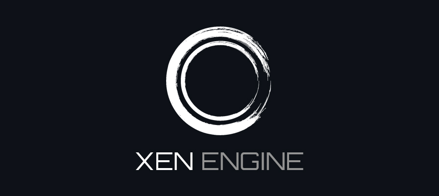

**XEN Engine** is a simple 2D game engine for Windows based on OpenGL. It uses a
`Scene -> GameObject -> Component`
organization structure to construct interactive levels.

## Features

- Lua-based scripting engine for runtime behavior.
- Fully-serializable scenes that can be created and edited with [XEditor](Tools/XEditor/README.md).
- Asset compression and packing using [XPak](Tools/XPak/README.md).
- Customizable content pipeline.
- Requires minimal external dependencies beyond linking against `XenEngine.lib`.

## Project Status

XEN Engine is still *very early* in development (read: unusable at the moment). While I commit new
code
to this repository every day, I'm just one dude building something for fun in his free time.

## Contributing

XEN is currently **closed** for contributions right now. Once a solid foundation has been built and
work transitions
to building new features and fixing bugs, then I will open up contributions to the community.